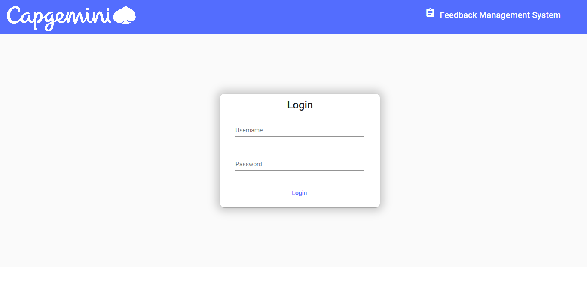
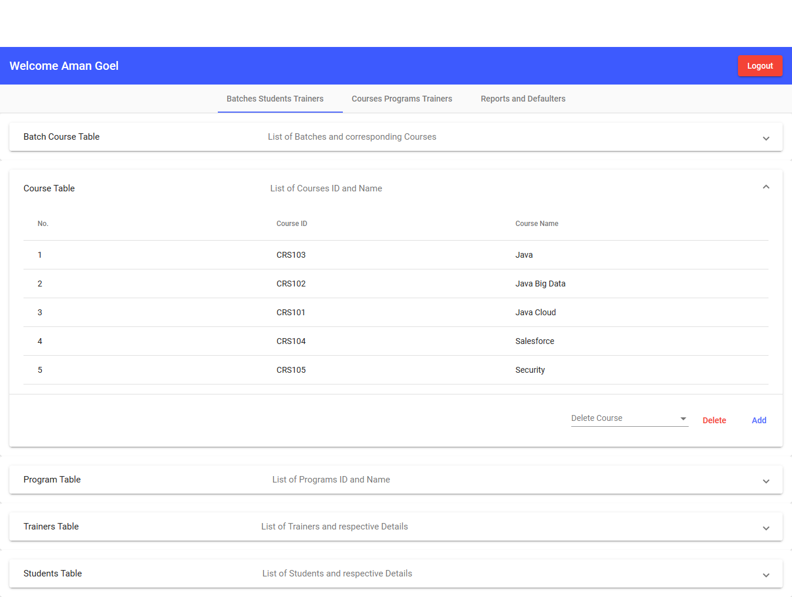
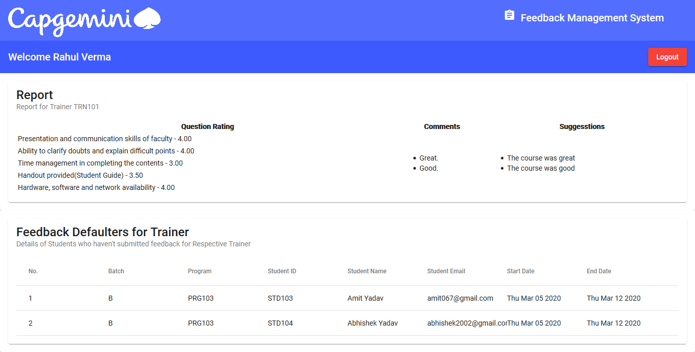
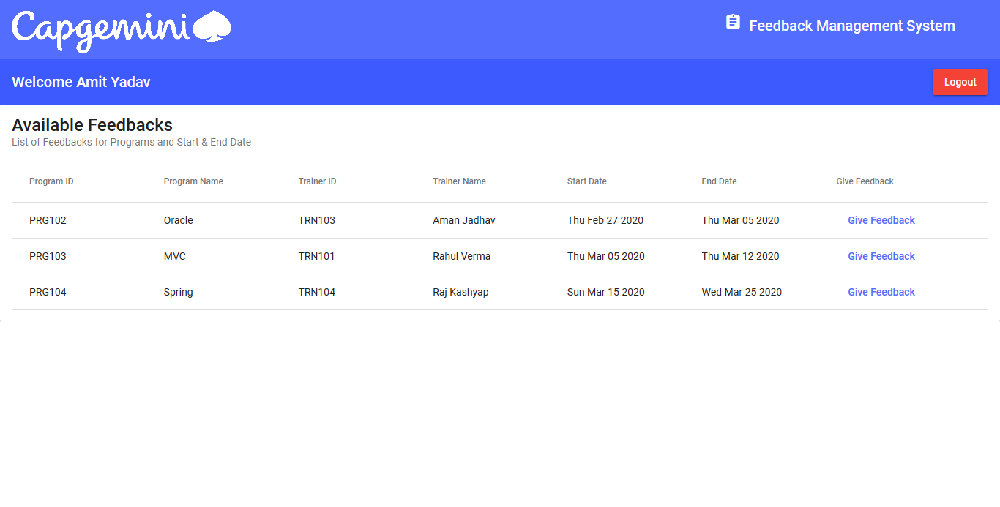

# Feedback Management Microservice
## 1. Introduction
This is the Feedback Management System which is a microservices based webapp for management of feedbacks. This project is aimed at
developing a Feedback management system for training programs as an integration of all independent micro services. This document contains the workflow of the system and gives guidelines on how to build the functionality gradually in each of the course modules.

## 2.Software/Tool Requirement
- Java
- Spring Boot
- Angular
- Maven
- MySql or H2 database

## 3. Functioanlity
Following is a list of functionalities of the system. There are 3 types of users. All users are the employees of the Data global solutions. The functionalities to be performed by the different users are as follows :
- Training Admin 
  - Maintain the skill set of faculties
  - Creation/modification/deletion of the Training Programs
  - Maintain the Training courses.
  - View the feedback reports based on trainers or programs.
  - View the feedback defaulters for trainers or programs.
- Training Coordinators
  - View Feedback report for itself.
  - View the Feedback Defaulters for itself.
- Participants/ Students
  - Enter feedback for the training programs attended
  
## 4. Description
- __Login Page__

- __Admin Dashboard__

- __Trainer Dashboard__

- __Student Dashboard__

